## Intro ##

    构建一个分布式服务器，可借鉴的muduo代码

**URL**

    https://github.com/chenshuo/muduo
    https://github.com/chenshuo/muduo-tutorial

**AsyncLogging**

    muduo-tutorial/src/echo.cc

**ProtobufCodec**

    examples/protobuf/codec/

**ThreadPool, setHighWaterMarkCallback, setWriteCompleteCallback**

    examples/sudoku/server_prod.cc

**PingPong**

    examples/pingpong/server.cc
    examples/pingpong/client.cc //EventLoopThreadPool, throughput
    
    examples/ace/logging/server.cc
    
    examples/sudoku/batch.cc //QPS

**CountDownLatch**

    examples/memcached/client/bench.cc //EventLoopThreadPool, QPS, pingpong
    examples/protobuf/rpcbench/client.cc
    examples/wordcount/hasher.cc

**outstandings_**

    examples/protobuf/rpcbalancer/balancer.cc
    examples/protobuf/rpcbalancer/balancer_raw.cc
    muduo/net/protorpc/RpcChannel.cc
         CallMethod
         onRpcMessage

// wire format
//
// Field     Length  Content
//
// size      4-byte  M+N+4
// tag       M-byte  could be "PB", "MP", etc.
// payload   N-byte
// checksum  4-byte  adler32 of tag+payload

message PbMessage
{
  required MessageType type = 1;
  required fixed64 id = 2;

  optional string typeName = 3;
  optional bytes request = 4;

  optional bytes response = 5;

  optional ErrorCode error = 6;
}

http://chenshuo.com/practical-network-programming/

# 网络编程实践

## 1


UNP 1e 1990

APU

TCP/IP v1-v3


UNP 2e 1998

​	v1: XPI已经淘汰

​	v2: 和网络编程关系不大，主要讲进程间通讯。多进程和多线程的并发编程

​	v3：应用，作者去世

v1：强调的不够：

​	1.消息格式的处理：非阻塞IO下正确处理TCP分包

​	2.并发模型稍显陈旧


UNP 3e 2003


避免基于猜测、猜想的优化

网络编程有很多以讹传讹的讲究，如：尽量减少动态内存分配，使用STL更是罪大恶极


以太网层：frame 帧

IP层：packet 分组（和IP分片是两个事情，一般不用管IP分片）

传输层：segment 分节

应用层：message 消息


2.有人说TCP不可靠，收到的数据不完整：主要涉及TCP连接断开的时机与条件，close太早的话，有可能导致协议栈发送rst分节，将连接重置，数据自然就收不完了。在阻塞编程中可以用SO_LINGER这个选项，在非阻塞编程中这个选项没用，需要从应用层的协议上入手解决。

4.C struct

​	1.考虑对齐，修改全局对齐方式，pack=1，导致第三方lib core dump：破坏ABI二进制接口

​	2.高度的不可扩展，如果增加一个字段，所有客户端、服务端都要升级。非C语言，需要手工维护pack on pack的代码

5.TCP客户端往本机的服务端发起连接时，如果服务端没有启来，在一定条件下客户端会和自己建立连接


## 2


验证TCP的有效带宽

atom -> e6400：118MB/s


本机测试

atom -> atom：dd：580MB/s（双核）


从磁盘读文件（第一次）：115MB/s


这是磁盘性能。

第二次测（数据已经缓存到内存里了，双核，两个进程：nc nc）：1074MB/s


nc加pv显示带宽（450，更慢一点，双核，四个进程：dd nc nc pv，dd本身也消耗资源）


top看每个进程占的cpu

atom -> e350：118MB/s


加pv


注意：pv用的2进制的兆字节，不是10进制，准确应该用Mib


比较内核态和用户态的操作

580：6个过程

1074：4个过程

如果只有TCP（2个过程），大约是580的3倍


172.29.233.89

```
[root@iZ2ze7qslbwa07f03lfmegZ ~]# nc -l 5001 > /dev/null
```

172.29.233.88

```
[root@iZ2ze7qslbwa07f03lfmehZ ~]# dd if=/dev/zero bs=1MB count=1000 | nc 172.29.233.89 5001
1000+0 records in
1000+0 records out
1000000000 bytes (1.0 GB) copied, 3.16583 s, 316 MB/s
```

本机测试

```
[root@iZ2ze7qslbwa07f03lfmehZ ~]# dd if=/dev/zero bs=1MB count=10000 | nc localhost 5001
10000+0 records in
10000+0 records out
10000000000 bytes (10 GB) copied, 9.45878 s, 1.1 GB/s
```

wget http://ftp-archive.freebsd.org/pub/FreeBSD-Archive/old-releases/amd64/ISO-IMAGES/8.2/FreeBSD-8.2-RELEASE-amd64-memstick.img

## 3


proxy：阻塞简单；非阻塞若两端带宽不匹配，复杂


数据交换从小到大。

分布式计算框架hadoop spark


## 4


https://en.wikipedia.org/wiki/Ttcp

https://en.wikipedia.org/wiki/Traceroute

现在比较流行Iperf

https://en.wikipedia.org/wiki/Iperf


带宽：只管消息量，

单核CPU是否能占满TCP千兆网带宽

吞吐量：应用层面

延迟：平均延迟，百分位数延迟

资源使用率

额外开销

​	加密：只有开销

​	压缩：先压缩后加密，反过来压缩起不到作用。

​		原1s。CPU压缩需要0.5s，若压缩率是50%，压缩后IO需要0.5s。用非阻塞IO，考虑到压缩和网络IO是可以重叠的，每次少量压缩发送，需要0.6-0.7s的IO，提高了拷贝文件的效率，代价是cpu使用率上升了一些。


客户端收到响应后再发下一次请求，比nc慢


这种情况下，非阻塞IO降低性能，多一步等待。去掉服务器的关闭连接的代码，可以直接支持并发。

https://github.com/chenshuo/recipes

https://github.com/chenshuo/muduo-examples-in-go

## 5

void transmit(const Options& opt)

void receive(const Options& opt)

:tabe common.h

char data[0]; //数组长度是运行时决定的

TCP_NODELAY不等TCP的ACK

## 6


cd recipes/tpc && make bin/ttcp


发送包大小：2^10, 2^11, ..., 2^16

9（机器cs组合） * 7（包大小种类） * 16（语言cs组合数）

nc和延迟无关，ttcp和延迟有关

atom -> e6400

-l 65535


-l 1024


-l 2048


-l 4096


-l 8192


-l 16834


-l 32768


-l 65536


-l 128000


-l 256000


测试时运行时间不能太短，TCP slow start 慢启动

-l 512000 -n 4096


消息越小，传输延迟的效用越大

atom -> atom


-l 4096


本机，消息大小4k的情况下，吞吐量超过了千兆网

-l 8192


-l 16384


-l 32768


-l 65536


-l 102400


-l 1024000


作为进程间通讯，即使在本机，TCP也是相当的强

## 7


阻塞IO有可能会一直阻塞过去

atom -> atom

20M的时候阻塞掉了


netstat


客户端发送缓冲区满了。服务端接收到部分数据，进行send，服务端等待客户端的recv，但客户端必须等到自己send完。服务端阻塞在send，又导致服务端不能recv，导致客户端阻塞在send。


20M是本机测试的结果，如果用网络上的两台机器，会显著小于这个数字（2M）


关键在于服务端没有完整的读到客户端的请求。服务端收到4K数据就发给客户端，但客户端没法收。

解决问题在于协议设计上。


## 8


netstat -ltnp

```
[root@iZ2ze7qslbwa07f03lfmehZ python]# python self-connect.py 22
connected ('127.0.0.1', 48600) ('127.0.0.1', 22)
^CTraceback (most recent call last):
  File "self-connect.py", line 17, in <module>
    time.sleep(60*60)
KeyboardInterrupt
[root@iZ2ze7qslbwa07f03lfmehZ python]# python self-connect.py 48600
connected ('127.0.0.1', 48600) ('127.0.0.1', 48600)
```

本机端口号

```
[root@iZ2ze7qslbwa07f03lfmehZ python]# sysctl -A |grep range
net.ipv4.ip_local_port_range = 32768    60999
```

本机，在端口范围之内，且没有使用的端口，都会发生自连接

```
[root@iZ2ze7qslbwa07f03lfmehZ python]# python self-connect.py 36000
connected ('::1', 36000, 0, 0) ('::1', 36000, 0, 0)
```

netstat -tpn | grep 36000

bool isSelfConnection(const Socket& sock)

## 9

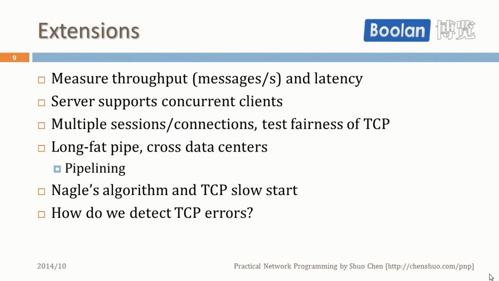

client，server，同一个随机数种子，生成随机数验证TCP有效性

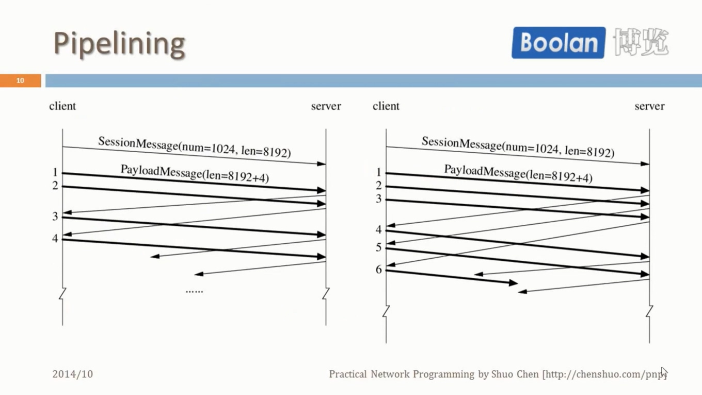

pipeline：如果延迟比较大，可以有效利用带宽

## 10


UDP

chenshuo.com/pnp


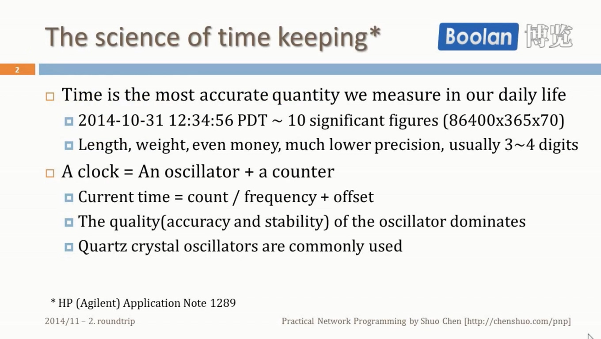

计时

精度最高的是美国的原子钟，10^-15

时钟=振荡器+计数器（精确）

改进振荡器


14.318M


ppm = 10^-6

ppb = 10^-9

电脑里用的是Clock XO

## 11


Timestamp: T*，不能相加，只能相减

Time interval: int，可以相加、相减

(T1+T2)/2 = T1 + (T2-T1)/2


L: 热胀冷缩等，需要调整，影响频率


Resolution: 分辨率

NTP最好部署在FreeBSD上

## 12


1.Daytime，Time精确到s

2.往返时间

NTP精确度: 0.25ns


NTP的复杂度不在网络编程上


## 13


UDP不可靠，不能用单线程阻塞IO，发送请求后等待回复

消息格式收发都是 8B+8B，为了对称性，对TCP有意义，以太网的最小帧长是64B。UDP会填充到最小帧长，意义不大。

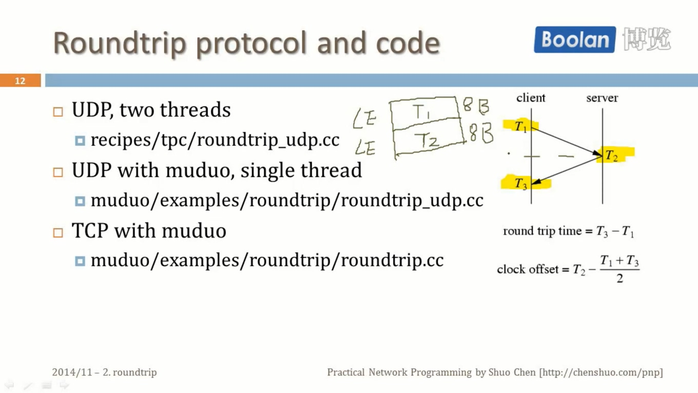

UPD server 1个socket可以服务多个client

yum install ntp

systemctl start ntpd

ntptime

ntpq -pn

C-z

bg

## 14


千兆以太网单程延迟100us


ntpdate -u 172.29.233.89
ntpdate cn.pool.ntp.org

## 15


UDP设计比TCP要晚。

UDP：NAT穿透

​	NTP

TCP：一个socket，一个线程读，一个线程写，是可以的。

## 16


UTC原子时

GMT天文时

UTC = TAI + Leap Seconds


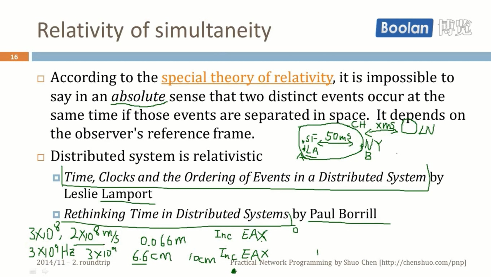

## 17


socket, stdin, stdout


难度: 建立TCP连接的难度 < 销毁TCP连接的难度

​	  TCP server建立连接的难度 < TCP client建立连接的难度

​	  接收TCP数据的难度 < 发送TCP数据的难度

recipes/tpc/bin/sender.cc


正确的做法：shutdown write导致对方的read返回0，对方close，我们的socket read也返回0，我们也close

## 18


tpc/bin/nodelay.cc

tpc/bin/nodelay_server.cc


## 19


并发连接数少的情况下，thread-per-connection性能比IO-multiplexing好，节约了等待IO就绪事件，epoll_wait()

## 20


Go: goroutine, channel, select

tpc/bin/netcat.cc

阻塞IO自动节流限速

nc atom 1234 < /dev/zero

nc atom 1234 | slow_reader

## 21


thread-per-connection适合连接数不多，线程比较廉价的情况

IO复用：一个线程处理多个fd，复用的不是IO而是线程thread of control

python/netcat.py

tpc/bin/chargen.cc


阻塞IO如果和IO复用配合的话，一旦真的发送阻塞，就会把别的socket上的事件挡住了。

## 22


python/netcat-nonblock.py

short write


## 23

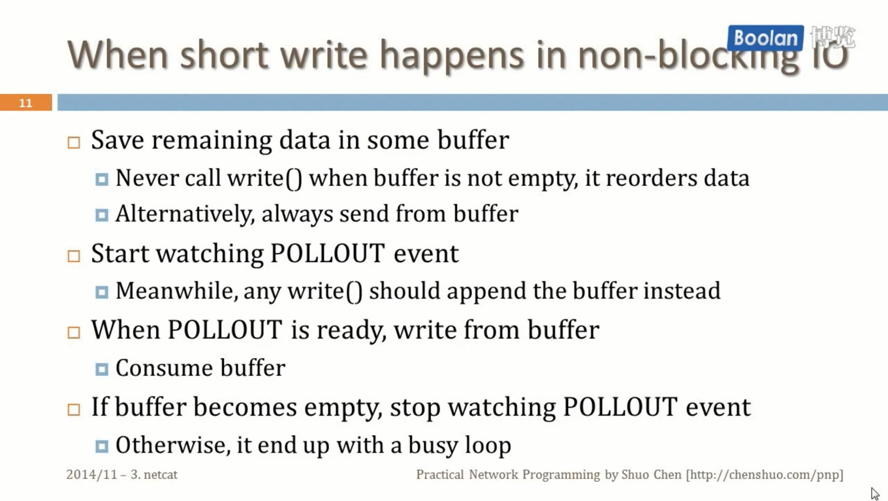

非阻塞读由应用程序处理，写由网络库处理


对方接收数据缓慢


ET: write, accept

LT: read


## 24

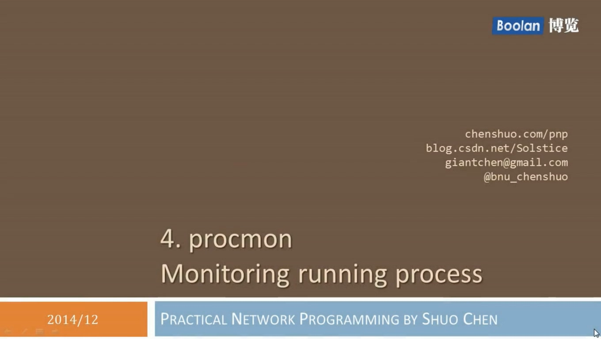


bin/procman 1 3000

examples/procmon/dummyload.cc

bin/dummyload c 80 2

top -H -p

## 25


python + matplotlib


## 26

examples/procmon/procmon.cc

void tick() // 采样


## 27


## 28

bin/procmon 1 3000

bin/procmon 3671 2345

ab -k -n 100000 http://localhost:3000/

ab -k -n 1000000 http://localhost:3000/

ab -k -n 500000 -c 5 http://localhost:3000/

ab -n 100000 http://localhost:3000/

htop


## 29


## 30


隔离度：内存密集型 > CPU密集型 > IO密集型


shutdown实现最难

memcached-1.4.22/t


## 31


阅读版本memcached 1.2.8


## 32

muduo/examples/memcached/server/footprint_test.cc

footprint 占资源的大小

tcmalloc

./memcached_footprint 1000000

perf record ./memcached_footprint 1000000

perf report

## 33


## 34

## 35


## 36


google-pprof --pdf bin/memcached_debug_tcmalloc http://localhost:11212 > set.pdf

sumatra pdf

## 37


https://gist.github.com/chenshuo/612177b4caf0c1ad7064

## 38


recipes/sudoku/test1


## 39


5.有并发，没并行


## 40

## 41


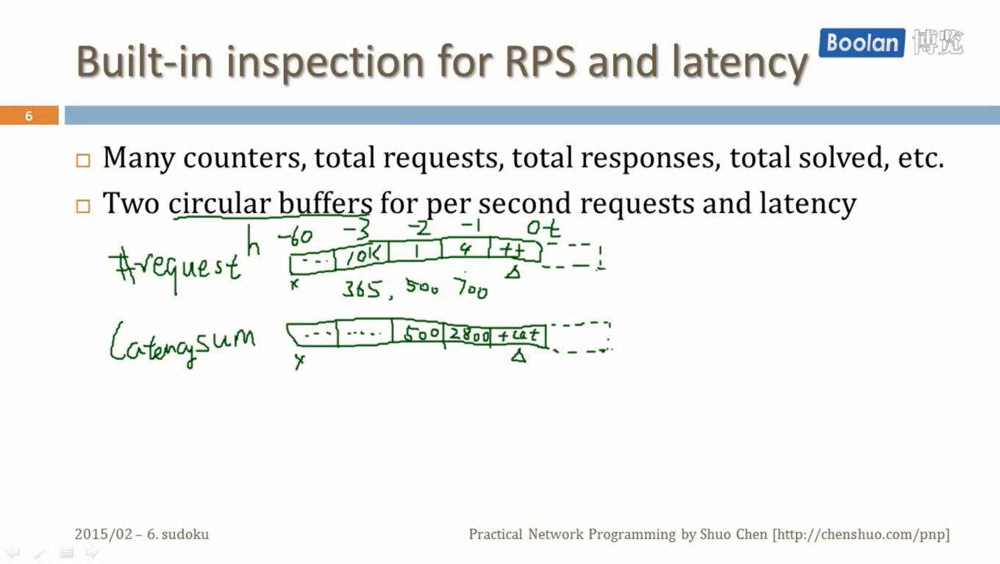


## 42

## 43

bin/sudoku_client_pipeline sudoku17 10.0.0.49 //测量延迟低

bin/sudoku_loadtest sudoku17 10.0.0.49 1000 //测量延迟高

原因：两者延迟计算方式不同

sudoku_client_pipeline 发数据均匀，请求返回后再发下一个

sudoku_loadtest 一次发多个，请求的累积，多个请求都返回再计算


bin/sudoku_client_pipeline sudoku17 10.0.0.49 10

bin/sudoku_client_pipeline sudoku17 10.0.0.49 1 10

client server 都要观察cpu

如果client cpu跑满了，而server cpu很空闲，实际是压力测试器自己的性能，不是server的性能

bin/sudoku_client_pipeline sudoku17 10.0.0.49 10 1

10个连接，IO开销略大一些，client cpu 高一些

less p0003

gnuplot

plot 'p0003' using 1:2 with boxes, 'p0003' using 1:3 with lines axes x1y2

set y2tics 20 nomirror

replot

set xrange[0:2000]

replot


bin/sudoku_solver_hybrid 4 0 -n


head p0002

fg


bin/sudoku_solver_hybrid 4 4 -n


sudoku_client_pipeline 测的是极限情况下

sudoku_loadtest 在某种合理情况下测

## 44

给定RPS，测量延迟分布

bin/sudoku_solver_hybrid 4 0 -n

server: top

10.0.0.49:9982/sudoku/stats

bin/sudoku_loadtest sudoku17 10.0.0.49 100

client和server测的延迟数值差很多，原因是网络部分的延迟server没有算进去


mv r0100 r-e4-t0-r100-c1

gnuplot

plot 'r-e4-t0-r100-c1' using 1:2 with boxes


bin/sudoku_loadtest sudoku17 10.0.0.49 1000

mv r0060 r-e4-t0-r1000-c1

plot 'r-e4-t0-r100-c1' using 1:2 with boxes, 'r-e4-t0-r1000-c1' using 1:2 with boxes

plot 'r-e4-t0-r1000-c1' using 1:($2/1000) with boxes, 'r-e4-t0-r100-c1' using 1:($2/100) with boxes


mv r0025 r-e4-t0-r10000-c1

plot 'r-e4-t0-r1000-c1' using 1:($2/1000) with boxes, 'r-e4-t0-r100-c1' using 1:($2/100) with boxes, 'r-e4-t0-r10000-c1' using 1:($2/10000) with boxes

只在IO线程做计算，不好。

bin/sudoku_solver_hybrid 4 4 -n

plot 'r-e4-t4-r100-c1' using 1:2 with boxes, 'r-e4-t0-r100-c1' using 1:2 with boxes

用了线程池，延迟的分布更集中。

## 45

bin/sudoku_loadtest sudoku17 10.0.0.49 20000

数据堆积在客户端，客户端内存不断增加

in-fly数据不断增加

recipes/tpc/bin/sudoku_stress.cc

./sudoku_stress 127.0.0.1

./sudoku_stress 127.0.0.1 200000

./sudoku_stress 127.0.0.1 200000 -r

10.0.0.37:9982/pprof/memstats

10.0.0.37:9982/pprof/releasefreememory


bin/sudoku_solver_hybrid 0 2

10.0.0.37:9982/pprof/memstats


muduo/examples/sudoku/server_prod.cc

highWaterMark: 5*1024 * 1024(5w条100Byte的消息未读)


请求过多，返回“busy”

发送回复数据量过多，关闭socket

## 46


## 47

muduo/examples/fastcgi/fastcgi_test.cc

nginx 1.6.2

nginx -p muduo/examples/fastcgi

psg nginx

netstat -tpna | grep 19981

curl -v http://localhost:10080/sudoku/0000...

./fastcgi_test 19981 2 > /dev/null

ab 只能测https1.0的长连接，不支持chunked。1.1的长连接用weighttp测。

weighttp -n 100000 -c 1 -k localhost:10080/sudoku/0000...

nginx -p muduo/examples/fastcgi -s stop

nginx -p muduo/examples/fastcgi -s reload


## 48


合理的延迟 -> RPS/core

RPS(daily peak) / (RPS/core) = core

core / (core/pc) = pc


## 49

## 50

## 51


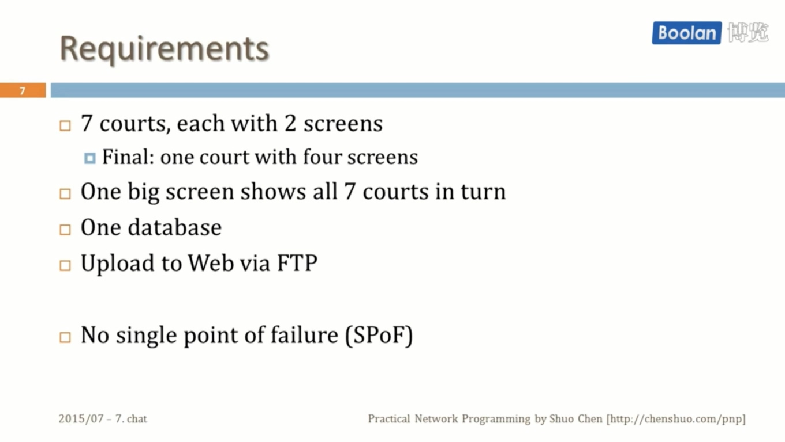

## 52


## 53


网络编程3个重要例子：

echo、chat、proxy

## 54

diff -u server.cc server_threaded.cc

fg

message数据拷贝

vim -p server*

## 55


相当于不止一个聊天室

## 56


实验，用C-z把一个client暂停起来，server内存会不断增长。

## 57


## 58


## 59


## 60

虚拟内存

//conn->stopRead();


server:

nc -l -p 3000

relay:

bin/tcprelay 127.0.0.1 3000 2000

client:

nc localhost 2000


pv /dev/zero | nc localhost 2000

nc -l -p 3000 > /dev/null


nc localhost 2000 < /dev/zero

nc -l -p 3000 | pv > /dev/null

nc -l -p 3000 | pv -L 1m > /dev/null

## 61

nc localhost 2000 < /dev/zero

nc -l -p 3000 > /dev/null


gdb bin/tcprelay 13409

bt

info threads

p this->startRead()

writeCompleteCallback_, highWaterMarkCallback_都是延迟回调

连接有相互关联的情况下，回调的顺序


## 62


## 63

https://en.wikipedia.org/wiki/Transport_Layer_Security#Basic_TLS_handshake

状态机

https://golang.org/src/crypto/tls/


https://hpbn.co/transport-layer-security-tls/

https://golang.org/src/crypto/tls/handshake_server.go

## 64


```go
func (srv *Server) Serve(l net.Listener) error {
```

```go
		rw, err := l.Accept()
		if err != nil {
```

https://golang.org/src/net/tcpsock.go

```go
// CloseWrite shuts down the writing side of the TCP connection.
// Most callers should just use Close.
func (c *TCPConn) CloseWrite() error {
	if !c.ok() {
		return syscall.EINVAL
	}
	if err := c.fd.closeWrite(); err != nil {
		return &OpError{Op: "close", Net: c.fd.net, Source: c.fd.laddr, Addr: c.fd.raddr, Err: err}
	}
	return nil
}
```

https://groups.google.com/forum/#!topic/golang-dev/cq-Y0vDXdwg

netstat -tpn

C-z fg

C-d

strace -tt nc -l -p 3000

## 65


## 66


https://research.google/pubs/pub44824/

## 67


https://www.zhihu.com/question/25016042/answer/29798924

TCP可靠：不重，不漏，不乱（没有说不改）


## 68


## 69


https://oeis.org/A000170

## 70


## 71


## 72

## 73

## 74


每次选出pending response最少的server来发请求。

## 75


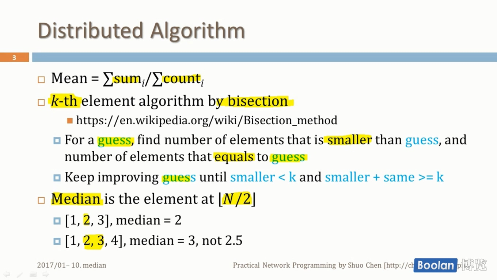


## 76


## 77


## 78


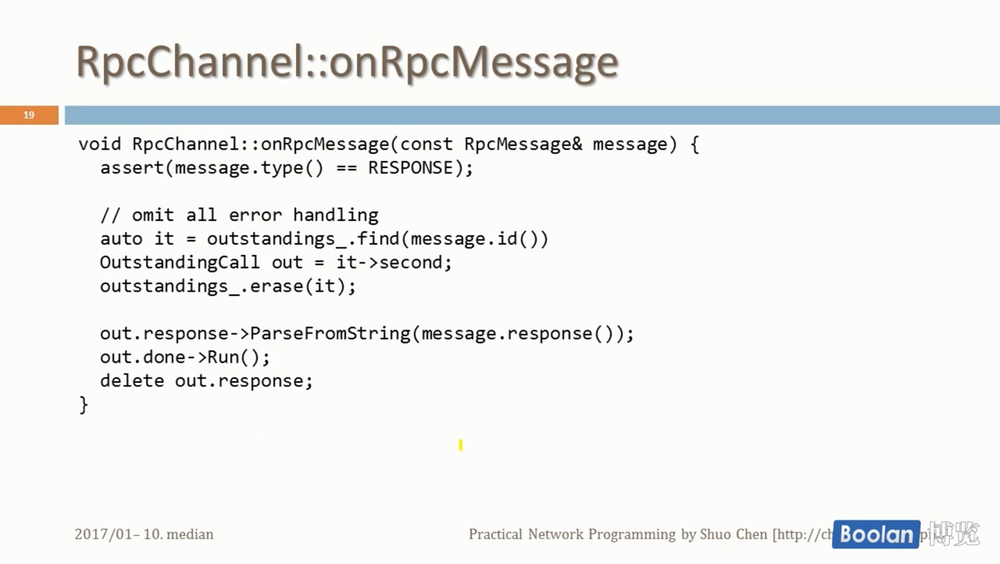


## 79


effective stl


https://www.cnblogs.com/baiyanhuang/archive/2012/11/11/2764914.html

## 80

recipes/topk

:set nowrap


## 81


## 83

http://chenshuo.com/tcpipv2/

http://www.kohala.com/start/tcpipiv2.html

http://chenshuo.com/tcpipv2/calltree/init.html

https://github.com/chenshuo/tcpipv2


## 84

https://www.zhihu.com/question/53747085/answer/2046814026

git show bd21010098

git blame Channel.h 

git show e2167e82

git blame Channel.h e2167e82


